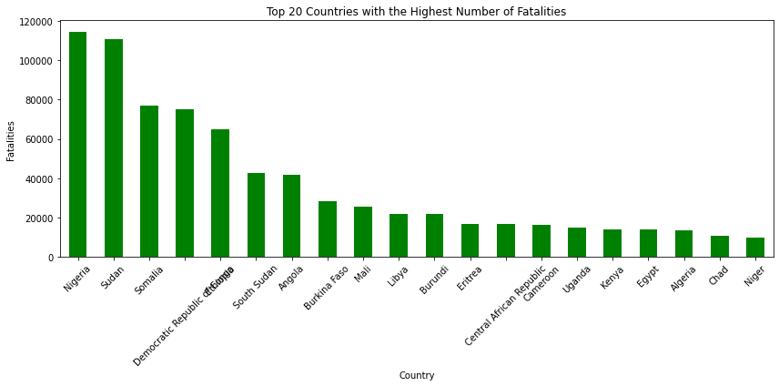

# **ANALYZING AFRICA'S CONFLICT LANDSCAPE TO INFORM BUSINESS INVESTMENTS**

# **BUSINESS UNDERSTANDING**
Africa is highly marketable to multinationals due to its vast natural resources, growing consumer market, and expanding economic opportunities. However conflict and Political instability can lead to supply chain disruptions, regulatory hurdles, and heightened security expenses, making it difficult for businesses to operate efficiently. Using a structured data driven approach, this project used a data set from https://acleddata.com/about-acled/ to;
1. Investigate insights on key risk factors causing the conflict, event forecasting, conflict risk score, and risk classification.
2. Analyze the data set to identify conflict prone areas, forecast conflict areas, establish conflict score for countries, risk classification for different countries.
3. Perform statistical tests to understand which areas are prone to conflict, their risk scores, forecast areas in future likely to experience conflict and classify different types of conflict.
4. Provide actionable recommendations to multinationals on conflicts in Africa in terms of areas prone to conflicts and types of conflict so they can formulate good risk management strategies.

# **Problem Statement**
A UK based multinational organization (VMagic Leather Processing Factory) is interested in establishing a manufacturing plant in a location that is less prone to conflict and political instability. The organization has hired our data science consulting firm to analyze data for different countries in Africa and come up with a model that can accurately determine conflict hot spots, come up with a risk score, and forecast conflict events.

# **Objectives**
1. **Conflict Analysis in Africa**: Establish a foundational understanding of conflict types, high-risk regions, and underlying causes by analyzing relevant data.
   
2. **Dataset Exploration**: Gain familiarity with the dataset’s structure, terminology, and quality by examining key variables, including numerical and categorical data.

3. **Business Insights for Site Selection**: Assist a multinational client in identifying conflict-free locations for a manufacturing facility by:
- Developing a predictive model to forecast conflict occurrences based on historical data and socio-political factors.
- Identifying key conflict drivers through correlation analysis of variables such as fatalities, disorder types, and actor involvement.
- Assessing spatial and temporal trends to understand conflict variations across regions and time periods.
- Evaluating conflict severity by predicting the likelihood of high-fatality events.
- Enhancing early warning systems through geographic risk assessments.
  
4. **Statistical and Predictive Analysis**
- Conduct descriptive and exploratory analysis using measures such as mean, median, variance, and frequency distribution.
- Perform correlation analysis to examine relationships between key variables.
- Apply hypothesis testing, including ANOVA, to compare disorder types across locations.
- Use predictive modeling techniques like logistic regression to assess conflict probabilities.
-Conduct trend analysis to visualize conflict patterns over time.

**Dataset Used**

This project used a data set from https://acleddata.com/about-acled/ a comprehensive repository of real-time data on political violence, protests, and other politically relevant events from around the world. The dataset is extensive with 413,948 rows and 31 features and was collected via a global network that aggregates reports from local, regional, and national media, government publications, and was collected between 1997 and 2025. ACLED further categorizes its events using a detailed classification system as outlined below. 

**Data Analysis** 
The Python Libraries used were; Pandas, Numpy, seaborn, matplotlib, sklearn.model_selection, sklearn.metrics, sklearn.preprocessing, sklearn.pipeline, scipy, statsmodels.api, statsmodels.stats.outliers_influence, sklearn.tree, sklearn.ensemble, sklearn.linear_model and xgboost

# Exploratory Data Analysis (EDA)

**Univariate Analysis - a. Interpretation of Numerical Variable Distributions**
The image below indicates that the **latitude distribution** shows clustering around specific values, indicating conflicts are concentrated  latitudes of between 5°N and 15°S) strongly representing countries within the Eastern, Western and Middle Africa regions. The high conectration in the eastern region is possibly due to ongoing conflicts, political instability, and social unrest in countries like Somalia, Nigeria, DRC, sudan, Kenya, Ethiopia and south sudan. The **longitude distribution** has multiple peaks, with the highest peak falling between 30°E and 50°E suggesting conflicts occur in distinct regions rather than being uniformly distributed. This reinforces the idea of localized conflict zones which occur towards the eastern part of the continent attributed to high conflucts in countries like Somalia.The **geo_precision distribution** shows most events have high location accuracy (1), but some have lower precision (2,3), indicating location uncertainty in certain records.The **fatalities distribution** is highly skewed, with most events having low fatalities and a few extreme cases. The log transformation compresses the scale, reducing the impact of extreme values while maintaining the trend.

**Univariate Analysis - b. Categorical Variable Distribution** 
The image below indicates that Political violence is the most dominant Disorder Type, followed by demonstrations while Strategic developments are less frequent.In regards to the event Type; Battles and violence against civilians are the most common, highlighting armed conflicts and civilian attacks.The Sub-event Type shows that Armed clashes, peaceful protests, and attacks dominate, showing a mix of violent and non-violent actions. lastly, the data also indicates that While most incidents don’t directly target civilians, a significant proportion still does.

**Univariate Analysis - c. Geographic distribution** 
The Eastern Africa Region has the highest number of conflict events, followed by Northern and Western Africa while Somalia and Nigeria are the most affected, with ongoing insurgencies and civil unrest.

**Bivariate Analysis**

Geospatial Distribution i.e. Latitude & Longitude, The scatter plots between latitude and longitude suggest distinct clusters, possibly representing regions with frequent conflict events. These clusters may align with high-risk conflict zones in Africa.
Geo-Precision vs. Other Variables, geo_precision is categorical (1, 2, or 3), limiting its numerical correlation. hence, It does not show a strong relationship with other variables, indicating location precision varies independently of fatalities or geography.
Fatalities vs. Log-Fatalities, fatalities is highly skewed, with a concentration of lower values and extreme outliers. but, The log transformation i.e. log_fatalities effectively normalizes this distribution, making patterns more discernible.
Fatalities vs. Geographical Variables, There’s no strong linear relationship between fatalities and location, though some regions may have higher conflict severity.

**Feature Engineering**
The data was split into conflict and non-conflict incidences where Battles, Violence against civilians and Explosions/Remote violence cleary indicate conflict since they can be defined as violent actions where the aim is a direct harm to people or infrastructure whereas the non-conflict incidencents can be defined as non violent actions since the aim was not to direct harm or destroy infrastructure and include Riots, Strategic Developments and Protests. 
Using the event type and the decision made in classifying if an event is a conflict or a non conflict, we will create a new feature called conflict_occured where **conflict related events** = 1 and **non-conflict related events** = 0

# **MODELLING**

