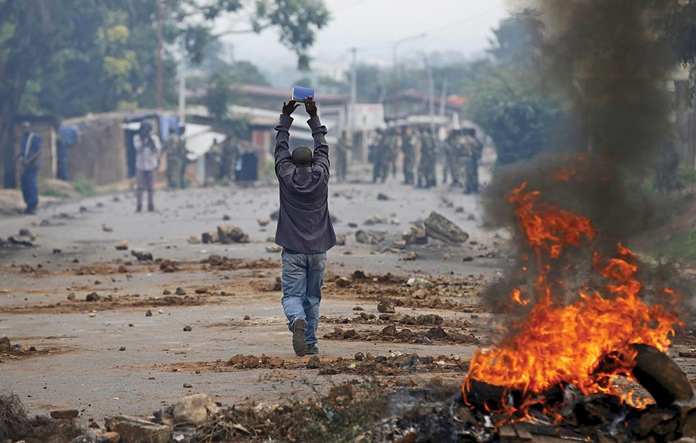
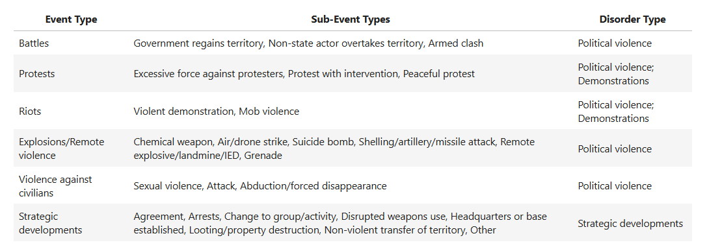
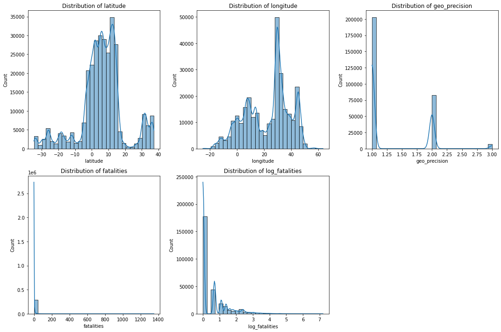
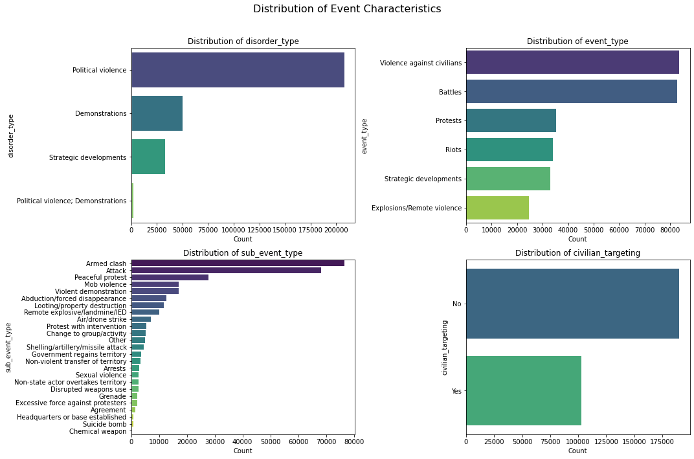
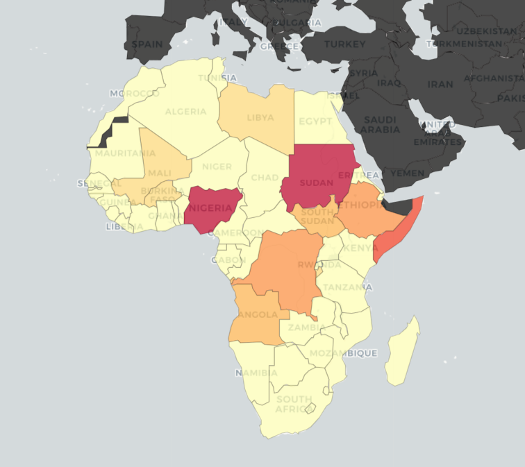
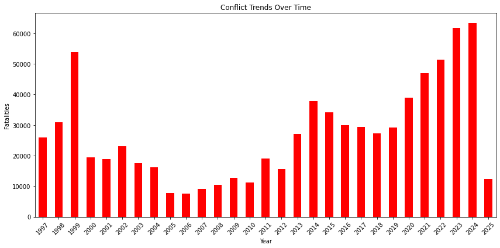
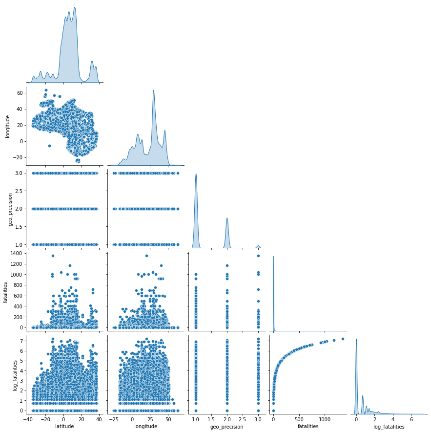
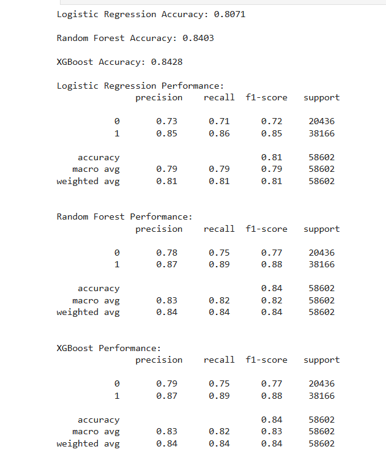

# **ANALYZING AFRICA'S CONFLICT LANDSCAPE TO INFORM BUSINESS INVESTMENTS**

# **BUSINESS UNDERSTANDING**
Africa is highly marketable to multinationals due to its vast natural resources, growing consumer market, and expanding economic opportunities. However conflict and Political instability can lead to supply chain disruptions, regulatory hurdles, and heightened security expenses, making it difficult for businesses to operate efficiently. Using a structured data driven approach, this project used the data set to;
1. Investigate insights on key risk factors causing the conflict, event forecasting, conflict risk score, and risk classification.
2. Analyze the data set to identify conflict prone areas, forecast conflict areas, establish conflict score for countries, risk classification for different countries.
3. Perform statistical tests to understand which areas are prone to conflict, their risk scores, forecast areas in future likely to experience conflict and classify different types of conflict.
4. Provide actionable recommendations to multinationals on conflicts in Africa in terms of areas prone to conflicts and types of conflict so they can formulate good risk management strategies.

# **Problem Statement**
A UK based multinational organization (VMagic Leather Processing Factory) is interested in establishing a manufacturing plant in a location that is less prone to conflict and political instability. The organization has hired our data science consulting firm to analyze data for different countries in Africa and come up with a model that can accurately determine conflict hot spots and forecast conflict events.

# **Objectives**
1)	Conduct a comprehensive conflict analysis in Africa by establishing a foundational understanding of conflict types, high-risk regions, and underlying causes 
2)	Explore the dataset to gain familiarity with its structure, terminology, and quality by examining key variables, including numerical and categorical data.
3)	Provide business insights for a multinational client to help identify conflict-free locations for a manufacturing facility by developing a predictive model to forecast conflict occurrences based on historical data
4)	Perform statistical and exploratory data analysis that includes correlation analysis, hypothesis testing, predictive modelling, and descriptive and exploratory analysis utilizing statistical measures
5)	Map and identify high-risk nations and areas to enhance early warning systems through geographic risk assessments. 

**Dataset Used**

This project used a data set from https://acleddata.com/about-acled/ a comprehensive repository of real-time data on political violence, protests, and other politically relevant events from around the world. The dataset is extensive with 413,948 rows and 31 features and was collected via a global network that aggregates reports from local, regional, and national media, government publications, and was collected between 1997 and 2025. ACLED further categorizes its events using a detailed classification system as outlined below. 

**Data Analysis** 
The Python Libraries used were; Pandas, Numpy, seaborn, matplotlib, sklearn.model_selection, sklearn.metrics, sklearn.preprocessing, sklearn.pipeline, scipy, statsmodels.api, statsmodels.stats.outliers_influence, sklearn.tree, sklearn.ensemble, sklearn.linear_model and xgboost

# Exploratory Data Analysis (EDA)

**Univariate Analysis - a. Interpretation of Numerical Variable Distributions**
The image below indicates that the **latitude distribution** is clustered around specific values, indicating conflicts are concentrated in certain regions rather than evenly spread. Some extreme values suggest conflicts occur across a broad range. The peak of the distribution lies North of the equtor suggesting most of the conflicts occur in the northern part of the equator. The **longitude distribution** has multiple peaks, with the highest peak falling between 30°E and 50°E suggesting conflicts occur in distinct regions rather than being uniformly distributed. This reinforces the idea of localized conflict zones which occur towards the eastern part of the continent attributed to high conflucts in countries like Somalia.The **geo_precision distribution** shows most events have high location accuracy (1), but some have lower precision (2,3), indicating location uncertainty in certain records.The **fatalities distribution** is highly skewed, with most events having low fatalities and a few extreme cases. The log transformation compresses the scale, reducing the impact of extreme values while maintaining the trend.

**Univariate Analysis - b. Categorical Variable Distribution** 
The image below indicates that Political violence is the most dominant Disorder Type, followed by demonstrations while Strategic developments are less frequent.In regards to the event Type; Battles and violence against civilians are the most common, highlighting armed conflicts and civilian attacks.The Sub-event Type shows that Armed clashes, peaceful protests, and attacks dominate, showing a mix of violent and non-violent actions. lastly, the data also indicates that While most incidents don’t directly target civilians, a significant proportion still does.

**Univariate Analysis - c. Geographic distribution** 
The Eastern Africa Region had the highest number of conflict events, followed by Northern and Western Africa while Nigeria, Sudan and Somalia had the highest fatalities with ongoing insurgencies and civil unrest. In terms of trends, 2024 had the highest number of fatalties followed by 2023 which is attributed to the ongoing disruptions in DRC.

**Bivariate Analysis**

Geospatial Distribution i.e. Latitude & Longitude, The scatter plots between latitude and longitude suggest distinct clusters, possibly representing regions with frequent conflict events. These clusters may align with high-risk conflict zones in Africa.
Geo-Precision vs. Other Variables, geo_precision is categorical (1, 2, or 3), limiting its numerical correlation. hence, It does not show a strong relationship with other variables, indicating location precision varies independently of fatalities or geography.
Fatalities vs. Log-Fatalities, fatalities is highly skewed, with a concentration of lower values and extreme outliers. but, The log transformation i.e. log_fatalities effectively normalizes this distribution, making patterns more discernible.
Fatalities vs. Geographical Variables, There’s no strong linear relationship between fatalities and location, though some regions may have higher conflict severity.

# **HYPOTHESIS TESTING**
**a. Event Type vs. Fatalities (ANOVA)**
Null Hypothesis (H₀): The average number of fatalities does not significantly differ across different event types.
Alternative Hypothesis (H₁): Some event types are associated with significantly higher or lower fatalities.
Since P_value generated was p < 0.05, we rejected the null hypothesis. This confirms that fatalities significantly vary by event type that is Some event types are far more fatal than others. This insight can help policymakers, security analysts, and businesses assess which types of conflicts pose the greatest risks.

**b. Region vs. Conflict Frequency (Chi-Square Test)**
Null Hypothesis (H₀): There is no significant difference in conflict frequency across regions.
Alternative Hypothesis (H₁): Certain regions experience significantly more or fewer conflicts than expected.
The chi-square test yielded a test statistic of 44930.9787 with a p-value of 0.0000, Since the p-value is extremely small p < 0.05, we reject the null hypothesis (H₀). This means that conflict occurrence is not evenly distributed across regions—certain regions experience significantly higher or lower conflict frequencies than expected. This finding suggests that some regions are more prone to conflict, while others remain relatively stable

**c. Interaction Type vs. Fatalities (ANOVA)** 
Null Hypothesis (H₀): The number of fatalities does not significantly vary based on the type of interactions (e.g., state vs. rebel group).
Alternative Hypothesis (H₁): Certain interaction types result in significantly higher or lower fatalities.
he ANOVA test yielded a test statistic of 1129.8259 with a p-value of 0.0000. Since the p-value is extremely small (p < 0.05), we reject the null hypothesis (H₀). This means that fatalities are not evenly distributed across interaction types—certain interaction types result in significantly higher or lower fatalities than others. This finding suggests that some types of interactions, such as those involving state forces or rebel groups, may be more lethal, while others result in fewer fatalities.

**Feature Engineering**
The data was split into conflict and non-conflict incidences where Battles, Violence against civilians and Explosions/Remote violence cleary indicate conflict since they can be defined as violent actions where the aim is a direct harm to people or infrastructure whereas the non-conflict incidencents can be defined as non violent actions since the aim was not to direct harm or destroy infrastructure and include Riots, Strategic Developments and Protests. 
Using the event type and the decision made in classifying if an event is a conflict or a non conflict, we will create a new feature called conflict_occured where **conflict related events** = 1 and **non-conflict related events** = 0

# **MODELLING**
The prefereed modeliing techniques for this project were Logistic regression, Random Forest Model and XGBoost Model where before hyperparameters interpretations; 

**Logistic Regression model** achieved an accuracy of 80.71%, with a precision of 0.73 for class 0 and 0.85 for class 1. The recall values were 0.71 and 0.86, respectively, meaning the model slightly favored predicting class 1 (conflict) over class 0 (no conflict). The overall F1-scores were consistent with precision and recall, indicating a fairly balanced performance.

**Random Forest model** achieved an accuracy of 84.03%, with a precision of 0.78 for class 0 and 0.87 for class 1. The recall values indicate that the model correctly identified 75% of class 0 instances and 89% of class 1 instances. The overall F1-score was 0.77 for class 0 and 0.88 for class 1, showing that the model was already performing well, especially in predicting class 1 events.

**XGBoost model** achieved an accuracy of 0.8422, with a precision of 0.78 for class 0 and 0.87 for class 1. The recall values were 0.75 for class 0 and 0.89 for class 1, indicating that the model was slightly better at capturing positive cases than negative ones. The F1-scores, which balance precision and recall, were 0.77 for class 0 and 0.88 for class 1, contributing to an overall strong performance. However, there was still room for improvement, particularly in recall for class 0

**Hyperparameter tunning for the models**

**Logistic Regression model** After tuning, the accuracy remained 80.71%, showing that the optimized parameters did not significantly impact overall performance. However, recall for class 0 slightly improved from 0.71 to 0.72, meaning the model became slightly better at identifying non-conflict cases. Precision and F1-scores remained nearly unchanged. This suggests that the default hyperparameters were already effective, and further tuning may not yield significant improvements.

**Random Forest model** The model’s accuracy slightly decreased to 83.93%, with class 0 precision reducing slightly to 0.77, while class 1 precision improved to 0.88. The recall values became more balanced, with class 0 increasing to 77%, while class 1 remained stable at 88%. The minor accuracy drop suggests that tuning made the model slightly more balanced between both classes but did not significantly improve its predictive power. The trade-off in precision and recall should be considered when deciding which version to use.

**XGBoost model** achieved an accuracy of 0.8406, maintaining strong predictive performance. The precision for both classes remained stable, while recall for class 0 stayed at 0.75, ensuring a balanced detection of conflict and non-conflict events. The macro and weighted averages remained consistent, indicating that the model retained its ability to generalize well across different cases. These results suggest that hyperparameter tuning fine-tuned the model without drastically altering its effectiveness.

# Interpretation of Results

**1. Logistic Regression** : Accuracy: 80.71%

Class 0 Recall: 72%
Class 1 Recall: 86% Logistic Regression performs reasonably well, but it has a lower recall for class 0, meaning it struggles more with identifying areas where conflict will not occur.

**2. Random Forest** - Accuracy: 83.93%

Class 0 Recall: 77%
Class 1 Recall: 88% Random Forest improves both recall and precision over Logistic Regression, making it a more balanced choice for conflict prediction.

**3. XGBoost** - Accuracy: 84.70%

Class 0 Recall: 76%
Class 1 Recall: 89% XGBoost has the highest accuracy and F1-score, meaning it performs best overall in predicting both conflict and no-conflict events. It maintains a strong balance between precision and recall.

# Best Model Recommendation

**XGBoost** is the best model to choose because it achieved the highest accuracy of **84.06%**– Outperforming the other models.The best **recall** for conflict cases was 89% – which will ensure high detection of conflict-prone areas and also attained a good balance between **precision and recall** hence minimizing false positives and false negatives.

# Deployment Link
The Africa conflict prediction system was deployed in render to access the prediction service follow the link below:
>>>> 🔗[Web_app link](https://dsf-pt08p5-group-11-capstone-project-1.onrender.com)
